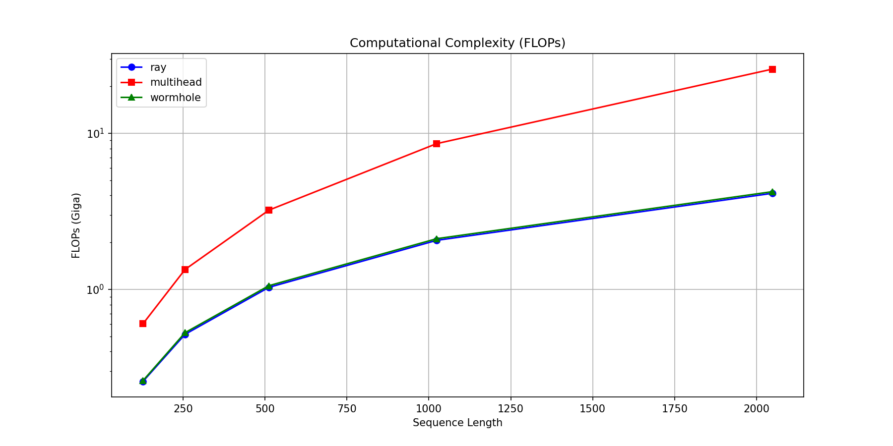
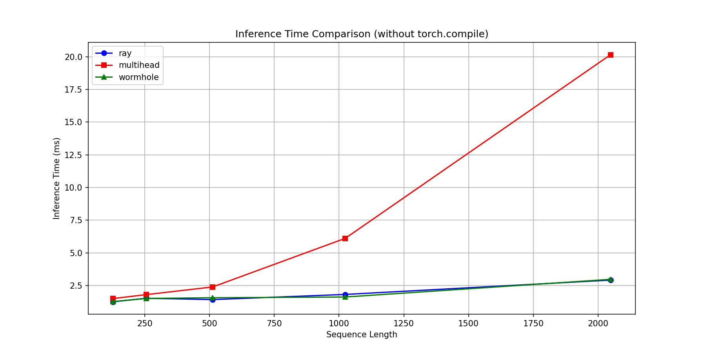

# Cepler-23: RayAttention Transformer

**Cepler-23** is a lightweight, fast Transformer model in which standard attention is replaced by **RayAttention**—a mechanism inspired by the concept of "wormholes." Instead of quadratic O(n²) complexity, we achieve linear O(n * rays) complexity, where *rays* is a fixed number of rays (defaulting to 8).

> 🕳️ *Imagine that each token communicates not with every other token, but only through a few "portals" (beams). It is as if an entire country exchanged messages via eight satellites rather than millions of direct wires.*

---

## ✨ Features

- **Linear complexity** — scales to long sequences (up to 2048+ tokens).
- **Energy efficiency** — reduces FLOPs by up to **84%** at a sequence length of 2048 compared to Multi-Head Attention.
- **Real-world speedup** — up to **6×** faster on a GTX 1660 Super (without `torch.compile`).
- **Built-in early exit** — allows exiting the model when confidence is high, saving resources.
- **Weight quantization** (4-bit) and **low-rank FFN** for further compression.

---

## RayAttention Architecture: Connectivity via "Wormholes"

### The Problem with Standard Attention
In classic Transformers, every token (a word or a segment of text) "communicates" with every other token. This requires a vast number of operations: if we have a sequence of `n` tokens, the number of connections grows at a rate of `n²`. For long texts (e.g., 2048 tokens), this becomes prohibitively expensive in terms of both memory and time.

### Our solution: rays as wormholes
We propose replacing the full network of connections with a **fixed set of "rays"** (8 in our implementation). These rays function like **wormholes**:
- Each token projects onto all the rays (sending its signal into each wormhole).
- The rays aggregate information from all tokens, creating a compressed representation.
- The rays then exchange data with one another.
- Finally, each token receives the aggregated signal back from all the rays.
- 
Instead of every token "calling" every other token (as in standard attention), tokens communicate only through 8 "portals." This reduces complexity from `O(n²)` to `O(n * 8)`, where 8 is a constant.

### Practical Advantages
- **Computational Efficiency:** For a sequence length of 512 tokens, our method requires **3.12 times fewer FLOPs** than standard attention.
- **Scalability:** The advantage grows as the sequence length increases. At 2048 tokens, the reduction in FLOPs reaches **84%** (see the graph below).
- **Real-world Speedup:** On a GTX 1660 Super, we observe an inference speedup of up to **~6x** for long sequences.

### A Real-World Analogy
Imagine that all the cities in a country need to exchange information. Instead of building direct roads between every pair of cities (which would require millions of kilometers of asphalt), we build **8 major hubs** (spokes). Each city sends its messages to the nearest hub, the hubs exchange summaries with one another, and then each city receives the aggregated information from all the hubs. This approach is cheaper, faster, and scalable to thousands of cities.

This is precisely how **RayAttention** works: we create "wormholes" in the feature space through which information passes almost instantaneously, without the quadratic explosion of connections.

## Results

We compared the proposed **RayAttention** with standard **MultiHead Attention** on a classification task (20 Newsgroups). The models shared the same configuration (d_model=256, 4 layers).

## FLOPs reduction


| seq_len | ray (ms) | multihead (ms) | wormhole (ms) | Ускорение wormhole vs multihead |
|--------:|---------:|---------------:|--------------:|--------------------------------:|
| 128     | 1.42     | 1.54           | 1.59          | 0.97x (a little slower)          |
| 256     | 1.52     | 1.60           | 1.86          | 0.86x (slower)               |
| 512     | 1.66     | 2.37           | 1.73          | 1.37x                           |
| 1024    | 1.72     | 6.12           | 1.67          | 3.66x                           |
| 2048    | 3.36     | 20.13          | 2.97          | 6.79x                           |



With short sequences, the Wormhole adaptation overhead may be noticeable, but with long ones, it yields the greatest benefit.

## 📦 Installation

```bash
git clone https://github.com/mikky1sCp/cepler-23-official.git
CD cepler-23-official
pip install -r requirements.txt
python setup.py install
```

## 💻 Usage example

```python
import torch
from cepler.models.transformer import CustomTransformer

# Creating a model with Wormhole
model = CustomTransformer(
    vocab_size=5000,
    d_model=256,
    num_heads=8,
    d_ff=512,
    num_layers=4,
    num_classes=2,
    max_len=128,
    attention_type='wormhole',   # 'ray', 'multihead' or 'wormhole'
    num_rays=8,
    lightweight_ffn=True,
    ffn_rank=64,
).cuda()

x = torch.randint(0, 5000, (4, 128)).cuda()
logits, exit_block, confidence = model(x, exit_threshold=0.95)
print(f"Output layer: {exit_block}, confidence: {confidence}")
```
## 🧪 Running benchmarks
All benchmarks are located in the `scripts/` folder. Run them all:
```bash
python scripts/run_all_benchmarks.py
```
Or separately:
```bash
python scripts/benchmark_flops.py          # FLOPs for seq_len=512
python scripts/benchmark_scale_flops.py    # FLOPs vs. seq_len plot
python scripts/benchmark_time.py           # inference time plot
python scripts/visualize_wormholes.py      # token distribution across beams
```
## 📁 Project structure
```Cepler-23/
├── src/cepler/            # main package
│   ├── models/            # Transformer, RayAttention, Wormhole
│   └── utils/             # energy monitor, quantization, FLOPs hooks
├── scripts/               # training and benchmarking scripts
├── plots/                 # generated plots
├── examples/              # usage examples
├── README.md
├── requirements.txt
└── setup.py
```
### Real inference acceleration

On a GTX 1660 Super GPU (without using `torch.compile`), RayAttention demonstrates a speedup of up to **X times** on long sequences (exact figures will be available once the benchmark is complete).
